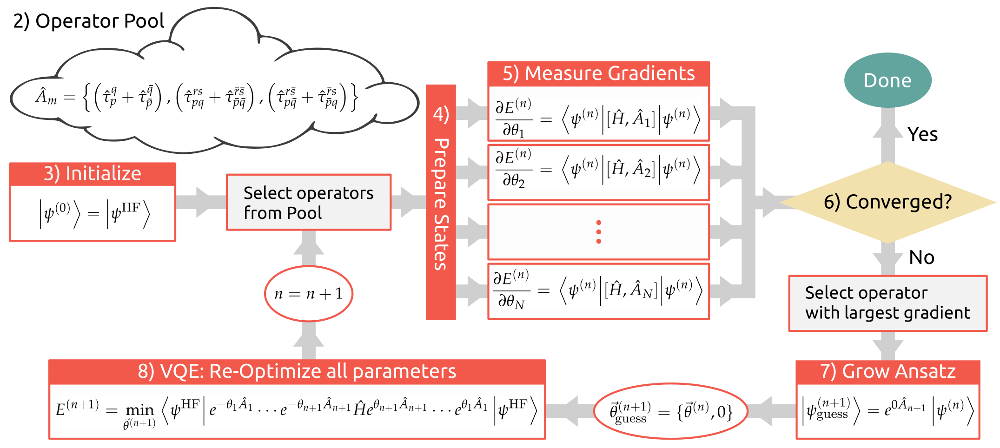

# Adaptive VQE

This project implements the algorithm proposed in https://arxiv.org/abs/1812.11173.

Our changes to Qiskit Aqua include the following additions:
* Implementation of the UCC class which is a modified version of UCCSD granting
  access to its underlying variational form via two new methods:
  `_append_hopping_operator` and `_append_hopping_operator`.
  This allows the simple realization of an adaptive variational form circuit.
* Implementation of the VQEAdapt class which extends the VQAlgorithm implements
  the iterative algorithm as outlined above.
* Currently, the gradients are computed using central differences, but it should
  be possible to implement these analytically using the supplementary information
  provided by the authors of the paper.
